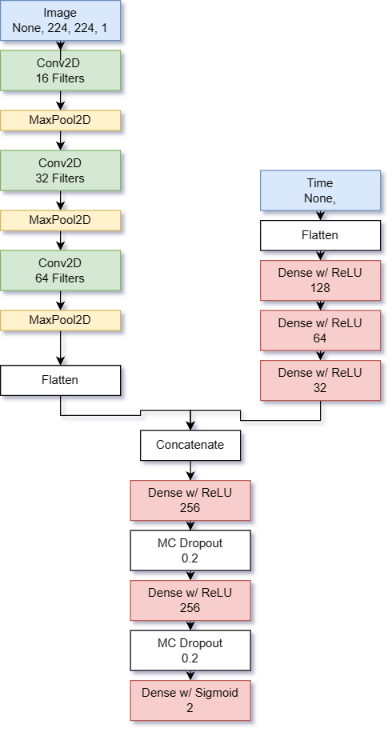
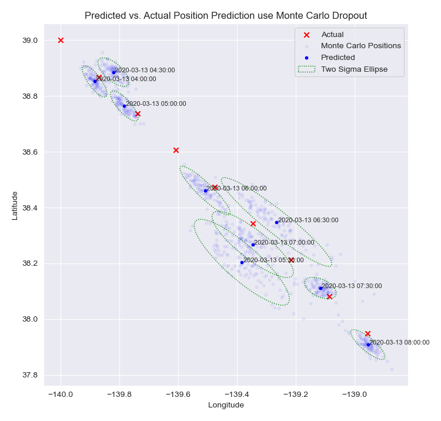

# Modern Celestial Navigation
---
### Marine Navigation via Computer Vision and Deep Learning
---

### Contents
[Problem Statement](#Problem-Statement)

[Background](#Background)

[Summary](#Summary)

[Results](#Performance)

[Conclusions](#Conclusions)

---
## Problem Statement 

The advent of safe and efficient GPS navigation is a landmark achievement in the history of science and technology. Despite the impressive accuracy and reliability of GPS systems, our dependence on satellite networks has become a point of concern. To ensure the continued advancement of safe marine navigation, there is a pressing need for alternative solutions. This project aims to address this issue by investigating the use of computer vision and deep learning to determine a ship's position via images of the stars with an accompanying time. 

## Background

Traditional trans-oceanic navigation involves the use of a marine sextant, an accurate time keeping device, and an accurate ephemeris (a compendium of astronomical information). Using these tools and spherical trigonometry, a skilled navigator is able to compute a *celestial fix* and determine their position to within a range of around 2 nautical miles. Our project endeavors to dispense with the sextant entirely and cast modern celestial navigation as a deep learning problem using a convolutional neural network. Our network will be fed a synthetic image of the sky with an accompanying time and predict a terrestrial latitude and longitude. 

---
## Summary 

We began by constructing a training grid for our model. The training grid must contain positions that our vessel will transit and images of the sky for each position over a sequence of time. It is a *spatio-temporal* grid. 

#### Training Grid 

To create the spatio-temporal training grid, we plotted a toy voyage off the coast of San Francisco, from 39°N, 140°W to 37°N, 138°W, a distance of 150 nautical miles. We computed a trackline from the origin to the destination, and created a buffer area of 10 nautical miles to the North and South by layering parallel tracklines separated by 1 nautical mile. Each trackline was divided into 100 positions, resulting in a grid that is 20 nautical miles wide and roughly 150 nautical miles long, with a distance of approximately 1 nautical mile between positions, yielding a total of 1919 unique positions.

*Positions in the Training Grid*

*Positions Layered in Time*

### Synthetic Celestial Images 

For each of the 1919 positions in the training grid, a synthetic image of the stars was generated using the Skyfield Python library. This library uses the DE421 Ephemeris from the Jet Propulsion Laboratory for celestial coordinates and can project these coordinates into a stereographic image. A synthetic image was created for each position every 6 minutes over a 4-hour period, as times that are stepped in 6-minute intervals are commonly used in traditional position fixing at sea. The final spatio-temporal grid has an image every 6 minutes for a 4 hour period, for each of the 1919 unique positions, a total of 78,679 images. 

*Our images of the sky created in Skyfield presented as a sequence along the toy voyage. The night sky rotates around the north star but also shifts as the vessel transits along the trackline*

### Model Selection and Topology

As the image above illustrates, a position is best learned as a *sequence* of images of the sky. Our goal was to construct a hybrid CNN-LSTM model, using the convolutional layers for the sequence of images and the LSTM layers for the sequence of times. This approach proved difficult, and we unable to produce a model that could converge to an acceptable level of loss.

Our next attempt was more conventional.The model takes two inputs: an input image tensor and an input time tensor. The input image is processed by a series of Convolutional layers, which consist of three Conv2D layers with 16, 32, and 64 filters respectively, each with a kernel size of 3 and ReLU activation. Between each Conv2D layer is a MaxPooling2D layer and the output from the last Conv2D layer is flattened using a Flatten layer.

The input time tensor is first flattened by a Flatten layer and then passed through three Dense layers with 128, 64, and 32 neurons respectively, each with ReLU activation.

The output from the CNN and Dense layers are concatenated and passed through two Dense layers with 256 neurons each, with ReLU activation. Both Dense layers are followed by Monte Carlo Dropout layers with a dropout rate of 0.2. The final output is produced by a Dense layer with 2 neurons and sigmoid activation, which outputs a vector of two values between 0 and 1 representing the predicted latitude and longitude, which are unnormalized to recover the predicted latitude and longitude.

**MC Dropout**

Normal dropout layers only dropout at training time, and serve as regularization to curb overfitting. For prediction time, the dropout is not applied and all nodes/connections are present. The model is thus deterministic: it will make the same prediction every time. 

For Monte Carlo dropout, the dropout is applied during training and during prediction time. Thus the prediction is no longer determinisitic but is now dependent on the nodes and links that were randomly chosen to be kept, and as a result, we will get a different prediction every time the model runs. 

The utility of this process is that we can now interpret the output of the model in a probabilistic way. A predicted position is no longer a single prediction, but is instead the mean of 100 predictions for the image, and from this distribution of predictions we are able to fix the position with a specified degree of statistical confidence and present the results visually with a confidence ellipse.

**Loss Function**

There is a non-linear relationship between Latitude and Longitude, so rather than use Root Mean Square Error or another more commonly used ML metric, we first tried to use Mercator sailing as the loss function to optimize.

**Mercator Loss**

A Mercator sailing is similar to plane sailing and is a trigonometric solution to course and distance on a mercator projection, however it accounts for the curvature of the earth by using the meridional parts of a Latitude. However, during model training it quickly became clear that Mercator sailing was not an appropriate loss function, as Mercator sailing is not a differentiable function at the poles -- the tangent function becomes undefined at these points. 

Instead, we turned to the solution used in this very similar and interesting project: [Deep Learning CelNav](https://github.com/gregtozzi/deep_learning_celnav), Haversine Loss. 

**Haversine Loss**

Given two points with latitudes $\phi_1$ and $\phi_2$, and longitudes $\lambda_1$ and $\lambda_2$, the initial course $\theta$ and distance $d$ between the points are given by:

$\theta = \arctan2(\sin(\Delta\lambda)\cos\phi_2, \cos\phi_1\sin\phi_2 - \sin\phi_1\cos\phi_2\cos(\Delta\lambda))$

$d = 2R\arcsin\sqrt{\sin^2(\frac{\phi_2-\phi_1}{2}) + \cos\phi_1\cos\phi_2\sin^2(\frac{\Delta\lambda}{2})}$

where $\Delta\lambda = \lambda_2 - \lambda_1$, $R$ is the radius of the sphere, and $\arctan2(y,x)$ returns the arctangent of $y/x$ taking into account the signs of $y$ and $x$ to determine the correct quadrant.

## Performance 

During modeling, the Haversine formula performed well using the  Adaptive Moment Estimation (Adam) optimization algorithm, with training loss converging to 1.6 Nautical Miles on our training data after 72 Epochs of Training.

The validation process consisted of simulating multiple voyages through the trainign area using different routes and different position fixing frequencies. The results were encouraging. We found that at the 1 hour, 30 minute, and 6 minute fix interval, on unseen images, the mean positional errors were under 1 nautical mile. These results suggest that the construction of the densely layered spatio-temporal training grid is valid. 

| Fix Frequency | Mean Positional Error (NM) | Standard Dev. Positional Error (NM) |
| ------------- | -------------------------- | ----------------------------------- |
| 1 Hour        | 0.78                       | 0.65                                 |
| 30 Minutes    | 0.67                        | 0.53                                 |
| 6 Minutes     | 0.88                        | 0.48                                 |

*Plot of predicted vs. actual positions as well as the monte carlo predictions and confidence ellipses for each positions*

## Confounding Elements

**Time Outside of Training Time Steps**

Our model was trained on images that were stepped in 6 minute intervals of time for a four hour period. However, when presented with an image that deviates from this base 6 system, the model breaks down and returns erroneous information. The plot below shows the results of validation images stepped in 20 minute increments.

**Clouds**

Our synthetic star image plotting functionality includes the capability to create random cloud coverage conditions ranging from 0/8 coverage to dense overcast 8/8 conditions. 

We evaluated the model's accuracy under 4/8 (partly cloudy) conditions and found that at the 30 minute fix frequency, 5 of the 9 images had haversine loss values less than 3 nautical miles, which was encouraging. However, the largest loss was 26 nautical miles. Upon examining the images of the clouds it was not abundantly clear what celestial patterns the model was using to render accurate results. 

**0600 Fix Image, Prediction was 1.71 NM From Actual**

**0530 Fix Image, Prediction was 26.3 NM from Actual**

# Conclusions

**What worked well:**

1. The dense spatio temporal grid architecture was successful. The neural network was able to reliably predict a position within 1 nm of its actual position provided that position was within the model's training grid parameters, i.e. the time was some multiple of 6 minutes and the position was within the 150 mile by 20 mile training grid.

2. The final model topology was successful. In particular, the Monte Carlo Dropout layers proved to be an effective way to increase the model's accuracy. An additional benefit of this method is that the position can now be interpreted as a probability distribution. The model predicts each position 100 times and plots the mean as the final predicted position, and from the predictions we are able to perform Eigendecomposition and plot a confidence ellipse to better understand the model's uncertainty.  

**What did not work:**

1. The model is memorizing what the sky looks like in the future, not learning a sequence of images of the sky. As a result, temporal interpolation is poor and an image taken at a time outside of the model's regular training interval results in an erroneous position.
While our study tried to implement a hybrid CNN-LSTM model to train on a sequence of the sky, the results were poor and we will leave this as an area of further exploration. Our CNN-LSTM model script is provided in the repository as a starting point for future projects.

2. Clouds clearly impact the predictive power of the model. A potential solution to this problem in an actual implementation would likely involve using near-infrared cameras to capture the images. Astronomers often use near-infrared observations to study the stars and their environments, as well as to observe objects that are obscured in visible light, such as dust clouds and protoplanetary disks.

3. Once the vessel leaves the training grid, all predictive power is lost. This is not unlike sailing without a chart of the area, if you do not have some sort of navigational armature upon which to base your predictions it is exceedingly difficult to navigate. An actual implementation would involve either having pre-loaded models for the intended transit or the ability to create and hot-swap models underway. 

